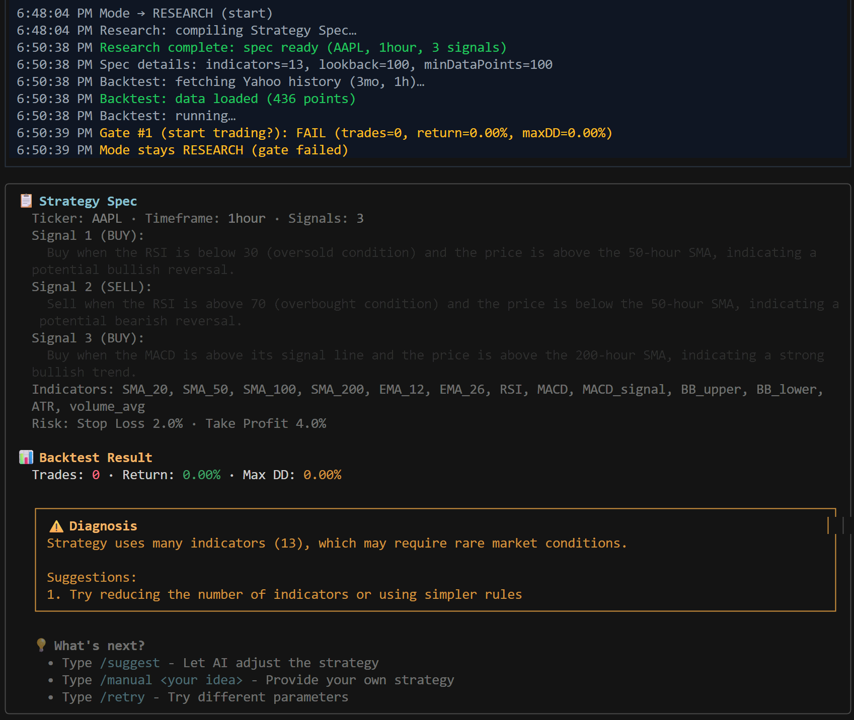

# 🥜 Pistachio

> AI-powered multi-agent trading system with LLM strategy generation, backtesting, and real-time execution

[](https://www.typescriptlang.org/)
[](https://www.langchain.com/)
[](https://bun.sh/)

## 🎯 Overview

Inspired by [Dexter](https://github.com/virattt/dexter), Pistachio is an agentic trading system that combines the analytical power of Large Language Models with disciplined quantitative execution. Beyond extracting data and info for market analysis, Pistachio also autonomously generates trading strategies, validates them through rigorous backtesting, and executes them in real-time.

### Key Features

- **🤖 Multi-Agent Architecture**: Separate Research and Trading modes for strategy generation and execution
- **📊 Intelligent Strategy Compilation**: LLM-powered analysis with 19+ integrated financial data tools
- **🔄 Adaptive Risk Management**: Automatic mode switching based on performance gates (drawdown, consecutive losses)
<!-- - **⚡ High-Performance Execution**: Sub-10ms deterministic trading decisions with compiled signal evaluation -->
- **🧪 Comprehensive Backtesting**: Realistic order simulation with slippage, commission, and risk parameters
- **🔍 Smart Diagnostics**: Auto-analysis of failed strategies with improvement suggestions
- **💻 Interactive CLI**: Claude Code-style terminal UI for transparent strategy inspection

## 🏗️ Architecture

```
┌─────────────────────────────────────────────────────────────┐
│                      Pistachio System                       │
├─────────────────────────────────────────────────────────────┤
│                                                             │
│  ┌─────────────────┐         ┌──────────────────┐           │ 
│  │  Research Mode  │-------> │  Backtest Engine │           │
│  │                 │         │                  │           │
│  │ • LLM Analysis  │         │ • Slippage       │           │
│  │ • Tool Calling  │         │ • Commission     │           │
│  │ • Strategy Gen  │         │ • Stop Loss/TP   │           │ 
│  └─────────────────┘         └──────────────────┘           │
│           │                           │                     │
│           │                           ▼                     │
│           │                  ┌────────────────┐             │
│           │                  │  Gate Checks   │             │
│           │                  │                │             │
│           │                  │ 1. Min Trades  │             │
│           │                  │ 2. Drift       │             │
│           │                  │ 3. Drawdown    │             │
│           │                  └────────────────┘             │
│           │                           │                     │
│           │                           ▼                     │
│           │                  ┌────────────────┐             │
│           └----------------->│ Trading Mode   │             │
│                              │                │             │
│                              │ • Real-time    │             │
│                              │ • No LLM calls │             │
│                              │                │             │
│                              └────────────────┘             │
│                                                             │
└─────────────────────────────────────────────────────────────┘
```




## 🚀 Quick Start

### Prerequisites

- [Bun](https://bun.sh/) runtime
- OpenAI API key or Moonshot (Kimi) API key

### Installation

```bash
# Clone the repository
git clone https://github.com/YOUR_USERNAME/pistachio-trading.git
cd pistachio-trading

# Install dependencies
bun install

# Set up environment variables
cp env.example .env
# Edit .env with your API keys
```

### Running the System

```bash
# Start the interactive CLI
bun run cli

# Example query
> Create an intraday strategy for AAPL on 1h timeframe; backtest on last 3 months; if gate passes then paper-execute on replay

# Follow-up commands after gate failure
> /suggest    # AI suggests improvements
> /manual <your strategy>  # Provide custom strategy
> /retry      # Try with different parameters
```

## 🧠 How It Works

### Research Mode

1. **Understanding Phase**: Extracts entities (tickers, timeframes) from user query
2. **Planning Phase**: Selects relevant tools from 19+ available options
3. **Execution Phase**: Calls tools (market data, news, indicators) in parallel
4. **Strategy Compilation**: LLM generates executable strategy spec with:
   - Trading signals (buy/sell conditions)
   - Technical indicators (SMA, RSI, MACD, etc.)
   - Risk parameters (stop loss, take profit)

### Gate System

**Gate #1: Can we start trading?**
- Minimum trades threshold (e.g., ≥3 trades in backtest)
- Acceptable drawdown (e.g., ≤20%)
- Return above minimum threshold

**Gate #2: Is something wrong?**
- Consecutive losses (e.g., 3+ in a row)
- Performance drift from backtest

**Gate #3: Emergency stop**
- Max daily loss hit (e.g., -5%)
- Drawdown limit exceeded

### Trading Mode

- **Deterministic Execution**: Pre-compiled signal evaluation (no LLM calls)
- **Low Latency**: <10ms decision time
- **Strict Risk Controls**: Automatic position sizing and stop management

## 📁 Project Structure

```
src/
├── agent/           # Multi-phase agent orchestrator
├── trading/         # Trading engine, backtesting, diagnostics
├── tools/           # Financial data tools (19+ integrations)
├── components/      # Terminal UI components
└── model/           # LLM interaction layer

examples/
├── hybrid-trading-demo.ts    # Full hybrid mode demo
└── test-function-calling.ts  # Tool calling verification
```

## 🛡️ Risk Management

Pistachio implements multiple layers of risk control:

- **Position Sizing**: Configurable max position size (default 10% of capital)
- **Stop Loss**: Automatic exit on adverse price movement
- **Take Profit**: Lock in gains at target levels
- **Max Drawdown**: System-wide circuit breaker
- **Overfitting Prevention**: Research and backtest data separation

## 🧪 Testing

```bash
# Run type checking
bun run typecheck

# Test function calling
bun run examples/test-function-calling-support.ts

# Run hybrid trading demo
bun run examples/hybrid-trading-demo.ts
```

## 📊 Supported Tools

- **Market Data**: Yahoo Finance, real-time quotes
- **Technical Indicators**: SMA, EMA, RSI, MACD, Bollinger Bands, ATR
- **News & Sentiment**: Financial news APIs
- **Economic Data**: Macro indicators, earnings calendars

## 🎨 UI Features

- **Claude Code-style Interface**: Familiar developer experience
- **Real-time Event Log**: Mode transitions, gate decisions, trades
- **Strategy Inspector**: View compiled signals and indicators
- **Smart Diagnostics**: Why strategies fail + suggestions
- **Multi-line Input**: Paste long queries without truncation

## 🔮 Future Enhancements

- [ ] Live trading integration (Alpaca, Interactive Brokers)
- [ ] Portfolio-level optimization
- [ ] Multi-asset strategies
- [ ] Machine learning signal validation
- [ ] Backtesting report generation (HTML/PDF)
- [ ] Strategy versioning and A/B testing

## ⚠️ Disclaimer

This software is for educational and research purposes only. Trading financial instruments involves substantial risk of loss. Past performance does not guarantee future results. Use at your own risk.

## 📝 License

MIT License - See LICENSE file for details

## 🙏 Acknowledgments

Built with:
- [Dexter](https://github.com/virattt/dexter) - An autonomous agent for deep financial research
- [LangChain](https://www.langchain.com/) - LLM orchestration
- [Ink](https://github.com/vadimdemedes/ink) - React for CLI
- [Bun](https://bun.sh/) - Fast JavaScript runtime
- [Yahoo Finance](https://finance.yahoo.com/) - Market data

---

Made with Perfectly Pistachio Passion❤🥜

